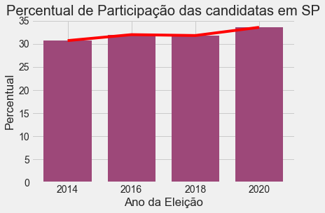
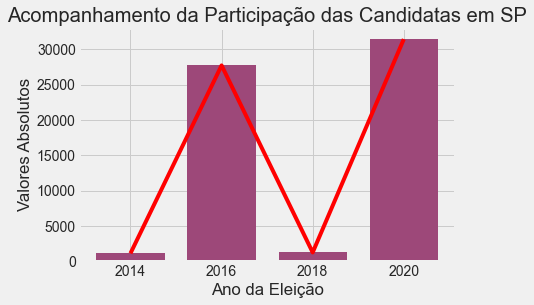
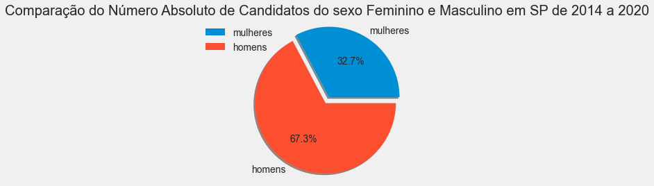
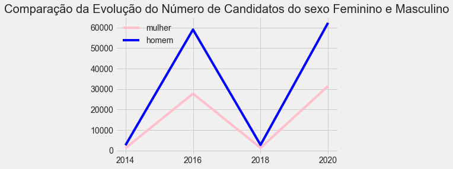

```python
import pandas as pd
import matplotlib.pyplot as plt
low_memory = False
```


```python
# declaraçãos das variáveis
df_2014 = pd.read_csv(r'Dados\consulta_cand_2014_SP.csv', delimiter= ';' , encoding='iso-8859-1', usecols=['CD_GENERO'])
df_2016 = pd.read_csv(r'Dados\consulta_cand_2016_SP.csv', delimiter= ';' , encoding='iso-8859-1', usecols=['CD_GENERO'])
df_2018 = pd.read_csv(r'Dados\consulta_cand_2018_SP.csv', delimiter= ';' , encoding='iso-8859-1', usecols=['CD_GENERO'])
df_2020 = pd.read_csv(r'Dados\consulta_cand_2020_SP.csv', delimiter= ';' , encoding='iso-8859-1', usecols=['CD_GENERO'])

ufs2 = ['SP']

```


```python
#Declarando váriaveis para produzir o gráfico
def_2014 = (df_2014.query("CD_GENERO == 4")["CD_GENERO"].count()) # Feminino
def_2014_2 = (df_2014.query("CD_GENERO == 2")["CD_GENERO"].count()) # Masculino
def_2014_total = (def_2014) + (def_2014_2)
def_2014_participacao = round((def_2014/(def_2014 + def_2014_2) * 100), 2)
def_2016 = (df_2016.query("CD_GENERO == '4'")["CD_GENERO"].count()) # Feminino
def_2016_2 = (df_2016.query("CD_GENERO == '2'")["CD_GENERO"].count()) # Masculino
def_2016_total = (def_2016 + def_2016_2)
def_2016_participacao = round((def_2016/(def_2016 + def_2016_2) * 100), 2)
def_2018 = (df_2018.query("CD_GENERO == 4")["CD_GENERO"].count()) # Feminino
def_2018_2 = (df_2018.query("CD_GENERO == 2")["CD_GENERO"].count()) # Masculino
def_2018_total = (def_2018 + def_2018_2)
def_2018_participacao = round((def_2018/(def_2018 + def_2018_2) * 100), 2)
def_2020 = (df_2020.query("CD_GENERO == '4'")["CD_GENERO"].count()) # Feminino
def_2020_2 = (df_2020.query("CD_GENERO == '2'")["CD_GENERO"].count()) # Masculino
def_2020_total = (def_2020 + def_2020_2)
def_2020_participacao =  round((def_2020/(def_2020 + def_2020_2) * 100), 2)
```


```python
print(f"\n*NÚMEROS*\n\n\n")
print(f"2014\n")
print(f"O número de candidatas foi de {def_2014}.\n")
print(f"O percentual de candidatas em relação aos candidatos foi de {def_2014_participacao} %.\n\n")
print(f"2016\n")
print(f"O número de candidatas foi de {def_2016}.\n")
print(f"O percentual de candidatas em relação aos candidatos foi de {def_2016_participacao} %.\n\n")
print(f"2018\n")
print(f"O número de candidatas foi de {def_2018}.\n")
print(f"O percentual de candidatas em relação aos candidatos foi de {def_2018_participacao} %.\n\n")
print(f"2020\n")
print(f"O número de candidatas foi de {def_2020}.\n")
print(f"O percentual de candidatas0 em relação aos candidatos foi de {def_2020_participacao} %.\n\n")
```

    
    *NÚMEROS*
    
    
    
    2014
    
    O número de candidatas foi de 1124.
    
    O percentual de candidatas em relação aos candidatos foi de 30.68 %.
    
    
    2016
    
    O número de candidatas foi de 27736.
    
    O percentual de candidatas em relação aos candidatos foi de 31.97 %.
    
    
    2018
    
    O número de candidatas foi de 1256.
    
    O percentual de candidatas em relação aos candidatos foi de 31.78 %.
    
    
    2020
    
    O número de candidatas foi de 31460.
    
    O percentual de candidatas0 em relação aos candidatos foi de 33.55 %.
    
    
    


```python
import numpy as np
plt.style.use("fivethirtyeight")

x = ['2014', '2016', '2018', '2020']
y = [(def_2014_participacao), (def_2016_participacao), (def_2018_participacao), (def_2020_participacao)]


plt.title('Percentual de Participação das candidatas em SP')
plt.xlabel('Ano da Eleição')
plt.ylabel('Percentual')
width_n = 0.75   # Largura das Colunas 
bar_color = '#9d4879' #cor barra
plt.bar(x, y, width=width_n, color=bar_color)
plt.plot(x, y, color='red')


plt.show()
```


    

    


```python
plt.style.use("fivethirtyeight")


x = ['2014', '2016', '2018', '2020']
y = [(def_2014), (def_2016), (def_2018), (def_2020)]

plt.title('Acompanhamento da Participação das Candidatas em SP')
plt.xlabel('Ano da Eleição')
plt.ylabel('Valores Absolutos')
width_n = 0.75   # Largura das Colunas 
bar_color = '#9d4879' #cor barra
plt.bar(x, y, width=width_n, color=bar_color)
plt.plot(x, y, color='red')

plt.show()
```


    

    


```python
plt.style.use("fivethirtyeight")

def_mul_total = (def_2014) + (def_2016) + (def_2018) + (def_2020)
def_hom_total = (def_2014_2) + (def_2016_2) + (def_2018_2) + (def_2020_2)

candidatos = [(def_mul_total), (def_hom_total)]
labels = ['mulheres', 'homens']

# define o nível de separabilidade entre as partes, ordem do vetor representa as partes
explode = (0.1, 0) 


# define o formato de visualização com saída em 1.1%%, sombras e a separação entre as partes
plt.pie(candidatos, labels=labels, autopct='%1.1f%%', shadow=True, explode=explode)

# inseri a legenda e a localização da legenda.
plt.legend(labels, loc=0)

plt.title('Comparação do Número Absoluto de Candidatos do sexo Feminino e Masculino em SP de 2014 a 2020')


# define que o gráfico será plotado em circulo
plt.axis('equal')

plt.show()
```


    

    


```python
plt.style.use("fivethirtyeight")

leg = ['2014', '2016', '2018', '2020']
m = [(def_2014), (def_2016), (def_2018), (def_2020)]
h = [(def_2014_2), (def_2016_2), (def_2018_2), (def_2020_2)]


plt.figure(figsize=(6, 4))
plt.plot(leg, m, color='pink', label='mulher') # green
plt.plot(leg, h, color='blue', label='homem')


plt.grid(True)
plt.title('Comparação da Evolução do Número de Candidatos do sexo Feminino e Masculino')
plt.legend()
plt.show()
```


    

    


```python
print('fonte:https://github.com/charles-ramos/participacao-mulheres-eleicoes-brasil/blob/master/Participacao-Mulheres-Eleicoes-Brasil.ipynb')
```

    fonte:https://github.com/charles-ramos/participacao-mulheres-eleicoes-brasil/blob/master/Participacao-Mulheres-Eleicoes-Brasil.ipynb
    
